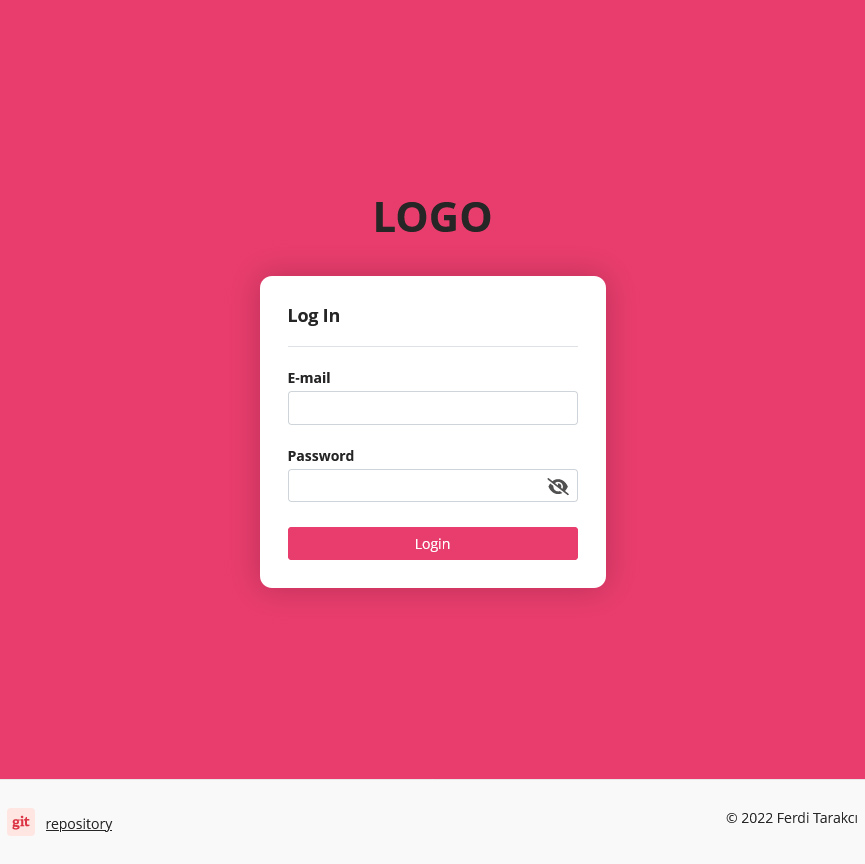
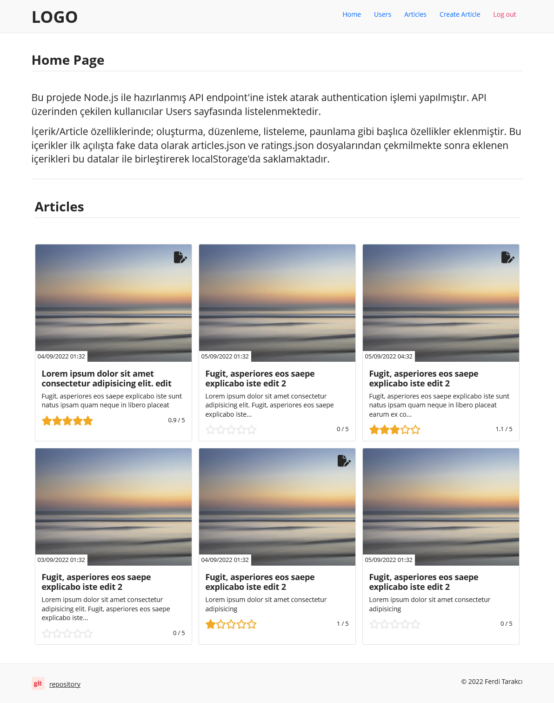
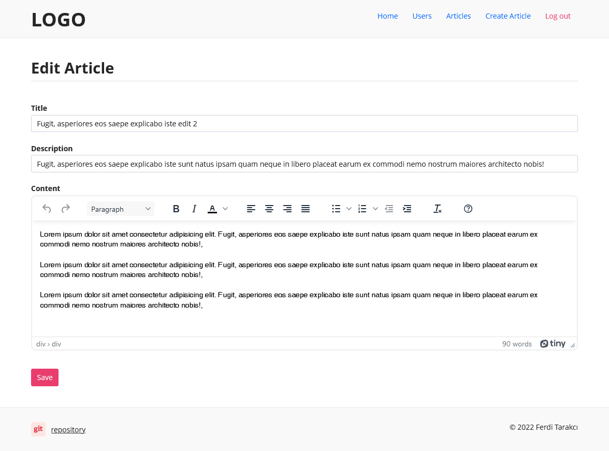

# Content Management System Application With React

## Application Description
This app is built using ReactJS. The application performs user authentication by making a request to a simple NodeJS API endpoint. Content/Article features; main features such as creating, editing, listing, scoring have been added. These contents are retrieved as fake data from the articles.json and ratings.json files on first launch, then combined with this data and stored in localStorage. Saved jobs are stored in localStorage.

## Uygulama Tanımı (TR)
Bu uygulama ReactJS kullanılarak oluşturulmuştur. Uygulama, basit bir NodeJS API uç noktasına istekte bulunarak kullanıcı kimlik doğrulaması gerçekleştirir. İçerik/Makale özellikleri; oluşturma, düzenleme, listeleme, puanlama gibi ana özellikler eklendi. Bu içerikler, ilk başlatmada articles.json ve ratings.json dosyalarından sahte veriler olarak alınır, ardından yeni eklenen verilerle birleştirilir ve localStorage'da saklanır.

## Deployment
This project is automatically put into production with Heroku.

Bu proje, Heroku ile otomatik olarak üretime alınıyor. (TR)
  

 

------

 

## Available Scripts

In the project directory, you can run:

### `npm start`

Runs the app in the development mode.\
Open [http://localhost:3000](http://localhost:3000) to view it in your browser.

The page will reload when you make changes.\
You may also see any lint errors in the console.

### `npm test`

Launches the test runner in the interactive watch mode.\
See the section about [running tests](https://facebook.github.io/create-react-app/docs/running-tests) for more information.

### `npm run build`

Builds the app for production to the `build` folder.\
It correctly bundles React in production mode and optimizes the build for the best performance.

The build is minified and the filenames include the hashes.\
Your app is ready to be deployed!

See the section about [deployment](https://facebook.github.io/create-react-app/docs/deployment) for more information.

 

------

 

## Screenshot 1

 
 

## Screenshot 2

 
 

## Screenshot 3

